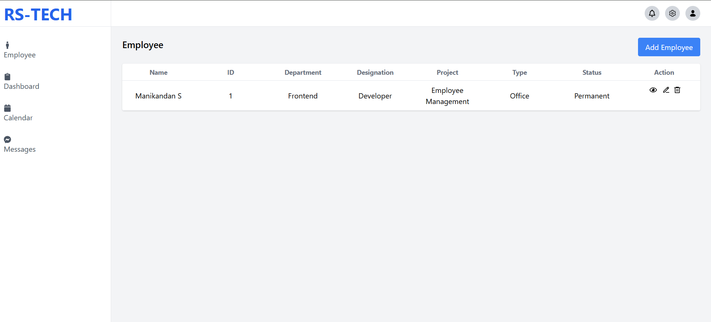
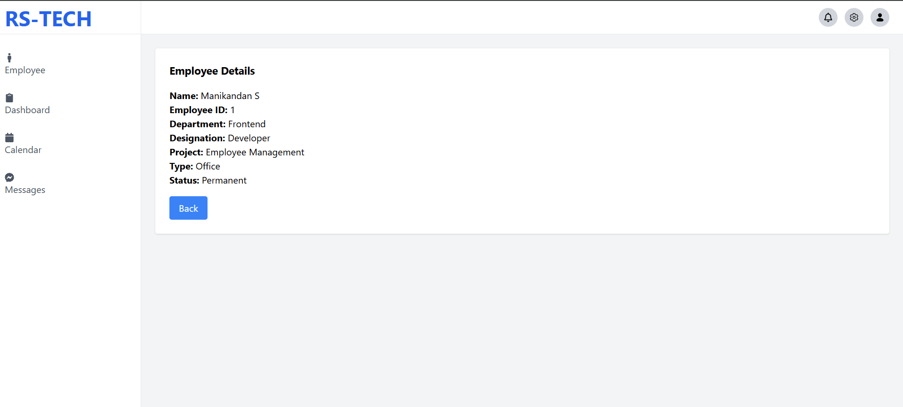
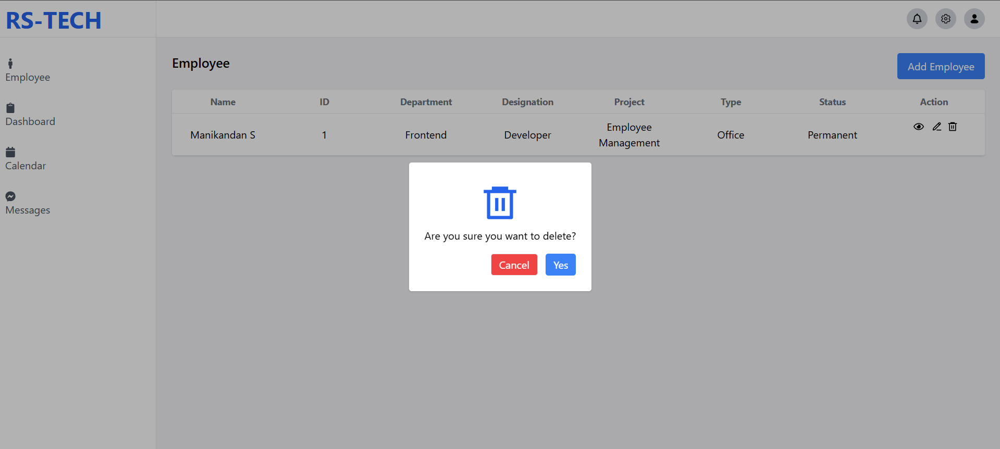

# Employee Management System

## Overview

This project is a simple Employee Management System built using React, Node.js, Express, and MySQL.

The main idea was to create a basic system where we can manage employee data with features like adding, editing, viewing, and deleting employees.

The UI is designed based on the provided Figma, and I tried to match it as closely as possible.

------

## Tech Stack

**Frontend**

* React (Vite)
* Tailwind CSS
* Axios
* React Router
* React-icons

**Backend**

* Node.js
* Express
* MySQL
* dotenv
* nodemon
* cors
* mysql2

-----

## Features

* Add new employees
* View employee details
* Edit employee data
* Delete employees
* Clean UI based on Figma
* API integration with backend
* Full CRUD functionality

-----

## Project Structure

```
Employee-Management-System-RS/

frontend/
  components/
  pages/

backend/
  control/
  config/
  model/
  view/
  server.js
```

------

## My Approach

I started by setting up both frontend and backend separately.
Initially, I focused on building the UI using React and Tailwind.

After completing the UI, I moved to backend development where I created APIs using Express and connected them with MySQL.

Later, I integrated the frontend with backend using Axios and worked on making the full CRUD operations work properly.

------

## Development Journey

**Day 1**

* Setup project structure
* Installed dependencies

**Day 2**

* Started UI (Sidebar, Navbar)

**Day 3**

* Completed employee form and table
* Setup routing

**Day 4**

* Started backend (routes, controllers, DB connection)

**Day 5**

* Faced API errors and fixed routing issues
* Debugged connection problems

**Day 6**

* Connected frontend and backend
* CRUD operations working
* Final adjustments

------

## Setup Instructions

### Clone the repository

```bash
git clone https://github.com/manikandan-dev7/Employee-Management-System-RS.git
```

------

### Backend Setup

```bash
cd backend
npm install
npm run dev
```

-----

### Frontend Setup

```bash
cd frontend
npm install
npm run dev
```

-----

### Environment Variables

Create a `.env` file inside the backend folder:

```
DB_HOST=localhost
DB_USER=root
DB_PASSWORD=your_password
DB_NAME=employee_db
PORT=5000
```

------

### Database Setup

Run the following SQL in MySQL:

```sql
CREATE DATABASE employee_db;

USE employee_db;

CREATE TABLE employees (
  id INT AUTO_INCREMENT PRIMARY KEY,
  name VARCHAR(100),
  employeeId VARCHAR(50),
  department VARCHAR(100),
  designation VARCHAR(100),
  project VARCHAR(100),
  type VARCHAR(50),
  status VARCHAR(50)
);
```

------

## Screenshot

### Dashboard


### Edit Employee Page


### View Employee Page


### Delete Employee Page


------

## Challenges Faced

* Backend connection issues (ERR_CONNECTION_REFUSED)
* API route mistakes
* Debugging frontend-backend integration
* Setting up MySQL properly

These issues helped me understand how real-world debugging works.

------

## What I Learned

* How frontend and backend communicate
* Handling API calls properly
* Debugging real-time errors
* Using environment variables securely
* Structuring a full-stack project

------

## Experience

This assignment was a really good opportunity for me to work on a full-stack project from scratch.

I got to face real-time issues and learned how to solve them step by step. It helped me improve both my technical skills and problem-solving approach.

------

## Final Note

I enjoyed working on this project and would be really happy to be part of a team where I can continue learning and improving.

------

## Author

Manikandan
GitHub: manikandan-dev7
